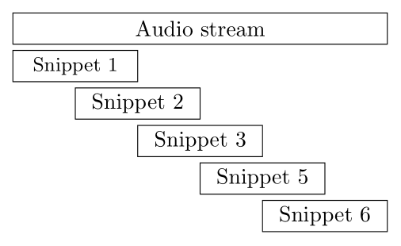
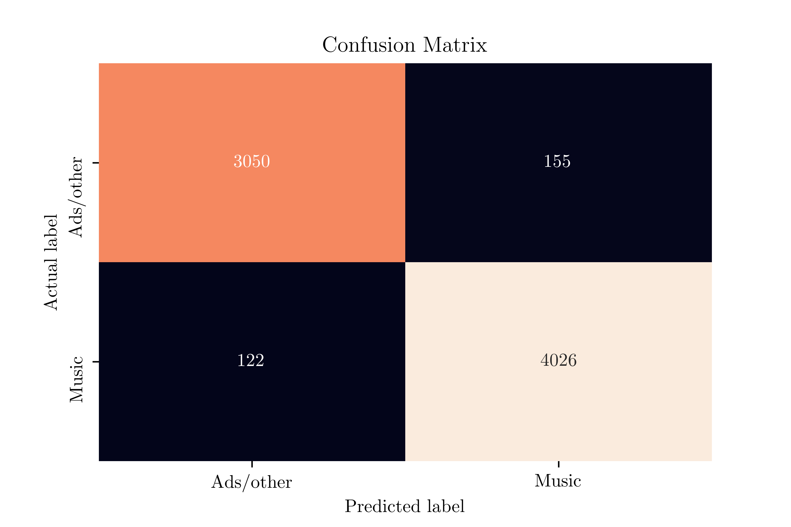

# Classification of radio audio using a CNN
This project applies a convolutional neural network (CNN) on a self-curated audio dataset, which consists of approximately 10 hours of audio from 11 Dutch radio stations, to classify the audio as music or advertisements.
The final model can be used filter out unwanted audio (i.e. advertisements or other audio that is not music) from radio streams.

## Requirements
- Python 3.6+
- ffmpeg (only needed for the creation of the dataset)

## Data gathering
Data was gathered from multiple different Dutch radio stations by using the audio streams used by the stations to stream the audio to the internet.
Audio from the following radio stations was used:

- NPO 3FM
- NPO Radio 1
- NPO Radio 2
- Qmusic
- Qmusic Non-Stop
- Radio 538
- Radio 538 Non-Stop
- Radio Veronica
- Sky Radio
- Sky Radio Non-Stop
- SLAM!

The bash script `record_streams.sh`, which makes use of [FFmpeg](https://www.ffmpeg.org/), was used to record the different audio streams.
This gave a total of approximately 10 hours of audio data recorded at 44,100 or 48,000 Hz, completing the dataset used for this project.
Since no corresponding labels are available for this audio, manual labelling was performed using the labelling features present in [Audacity](https://www.audacityteam.org/).
All audio can belong of one of two classes, music or ads/other. After all audio was labelled the labels were exported to `txt` files which could then be used in the preprocessing steps.

The audio files resulting from the steps above are still quite long, ranging between 10 minutes and multiple hours.
Before this audio can be used to train any model on they will have to cut into smaller audio segments.
This is done using the script `create_snippets.py`, which cuts the long audio streams into 1 second audio segments with 50% overlap between the segments, padding any segments with at least 500 ms of audio up to 1 second.



After cutting up the audio into snippet the scripts automatically splits up the dataset into training, validation, and test datasets using a 70%, 20%, 10% split respectively.
Cutting up the audio streams into 1 second snippets and creating the split, each of the dataset consists of the following number of audio snippets for each class:

| Split      | Class     | Snippets |
|------------|-----------|----------|
| Training   | Music     | 29486    |
|            | Ads/other | 22464    |
| Validation | Music     | 8482     |
|            | Ads/other | 6491     |
| Test       | Music     | 4148     |
|            | Ads/other | 3205     |

## Data preprocessing
Some preprocessing is performed on the raw audio signal before being used as input to train the neural network on.
The preprocessing steps are performed during training using a PyTorch `DataLoader` class.
The following preprocessing steps have been performed:

1. Convert the stereo audio signal to mono
2. Downsample the audio signal to 22,050 Hz
3. Create a mel spectrogram of the audio signal
4. Convert the mel spectrogram to a log-scale mel spectrogram
5. Augment the log-scale mel spectrogram by performing time and frequency masking

For the creation of the mel spectrogram in step 3 the following parameters are used: 128 mels, 1024 fast fourier transforms, and a window length and hop length of 512 ms.

## Network architecture
The output from the preprocessing steps described above is an image of the audio signal.
A type of neural network that often performs well on this type of unstructured data are Convolutional Neural Networks, or CNN for short.
Given the performance of CNNs on existing audio datasets (such as the YouTube-100M dataset) a CNN is also applied on this dataset to perform classification of the audio.
A CNN architecture similar to the popular VGG architecture is used, meaning that it consists of multiple convolutional blocks followed by multiple fully connected layers, as shown in the graphic shown below.


```
----------------------------------------------------------------
        Layer (type)               Output Shape         Param #
================================================================
            Conv2d-1          [-1, 16, 128, 32]             160
            Conv2d-2          [-1, 16, 128, 32]           2,320
         MaxPool2d-3           [-1, 16, 64, 16]               0
            Conv2d-4           [-1, 32, 64, 16]           4,640
            Conv2d-5           [-1, 32, 64, 16]           9,248
         MaxPool2d-6            [-1, 32, 32, 8]               0
            Conv2d-7            [-1, 64, 32, 8]          18,496
            Conv2d-8            [-1, 64, 32, 8]          36,928
            Conv2d-9            [-1, 64, 32, 8]          36,928
        MaxPool2d-10            [-1, 64, 16, 4]               0
           Conv2d-11           [-1, 128, 16, 4]          73,856
           Conv2d-12           [-1, 128, 16, 4]         147,584
           Conv2d-13           [-1, 128, 16, 4]         147,584
        MaxPool2d-14            [-1, 128, 8, 2]               0
           Linear-15                 [-1, 1024]       2,098,176
          Dropout-16                 [-1, 1024]               0
           Linear-17                  [-1, 512]         524,800
          Dropout-18                  [-1, 512]               0
           Linear-19                    [-1, 1]             513
================================================================
Total params: 3,101,233
Trainable params: 3,101,233
Non-trainable params: 0
----------------------------------------------------------------
```

The four convolutional blocks consist of two or three convolutional layers with 3x3 kernels followed by a 2x2 max pooling layer.
The number of filters used for each convolutional layers starts at 16 for the first convolutional block and doubles each time after that.
All convolutional and fully connected layers use a ReLU activation, except the output layers which uses a sigmoid activation.
During training, two dropout layers are used between the three fully connected layers using dropout percentages of 50 and 30 percent.

## Training
The CNN has been trained for a total of 20 epochs with a batch size of 32 and a binary cross-entropy loss function.
The Adam optimizer with a learning rate of 0.001 is used, combined with a step learning rate scheduler which decreases the learning rate after 10 epochs to 0.0001.
The graphs below show the loss and accuracy during the training process for both the training and validation dataset.


## Model performance
To accurately assess the performance of the trained model, the model is tested on the out of sample test dataset, which consists of 7353 audio snippets.
The standard threshold of 0.5 is chosen to assess how well the model performs, the performance (i.e. precision and recall) using a different 

| Metric    | Score  |
|-----------|--------|
| Accuracy  | 0.9623 |
| Precision | 0.9629 |
| Recall    | 0.9706 |
| F1 Score  | 0.9667 |
| AUC-ROC   | 0.9611 |




Overall, it seems that the model is performing quite well given the 96.23% accuracy on the balanced dataset.
A more detailed overview of the model's performance (including samples which it gets wrong) can be found in `predict.ipynb` ([Jupyter Notebook Viewer](https://nbviewer.jupyter.org/github/rvdmaazen/Radio-Audio-Classification/blob/master/predict.ipynb) can be used to view the notebook and listed to the audio).